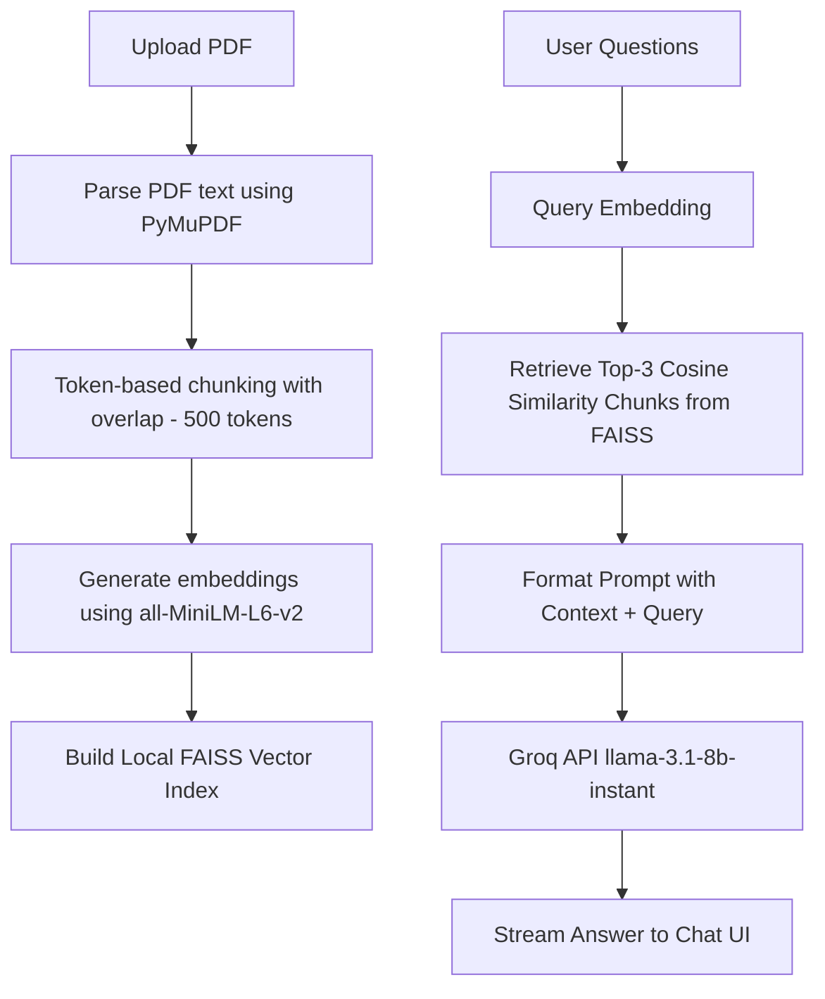

# 🧠 DocuMind

An elegant, real-time PDF Q&A assistant built with Streamlit, sentence-transformers, FAISS, and Groq's high-speed API.

[](https://streamlit.io)
[](https://groq.com)
[](https://github.com/facebookresearch/faiss)
[](https://sbert.net)
[](https://pymupdf.readthedocs.io/)

---

## 📽️ Demo


https://github.com/user-attachments/assets/95e02a7e-888a-41bc-a9bf-d1568ad7b023


---

## 📝 What It Does

DocuMind lets you upload any PDF document, automatically chunks and indexes its content in a local high-performance vector database, and lets you ask complex questions about the document in an interactive chat. It retrieves exact relevant contexts using semantic search and streams the answer using the high-performance Llama 3 model on Groq.

---

## 🧬 How It Works

DocuMind uses a modern **Retrieval-Augmented Generation (RAG)** pipeline to query your documents securely and fast:



---

## ⚡ Setup in 3 Steps

Follow these simple steps to run DocuMind locally on your system:

### Step 1: Clone and Navigate
```bash
git clone https://github.com/Harsh33t/PortAI.git
cd stock_analysis/documind
```

### Step 2: Install Dependencies
Ensure you have Python 3.9+ installed, then run:
```bash
pip install -r requirements.txt
```

### Step 3: Configure and Run
Create a `.env` file in the `documind` folder (or edit the template `.env`) and add your Groq API Key:
```env
GROQ_API_KEY=gsk_your_groq_api_key_goes_here
```
Now, launch the Streamlit server:
```bash
streamlit run app.py
```

---

## 🚀 Future Improvements

- **Multi-PDF Indexing**: Support uploading and indexing multiple PDFs at once to query across your entire digital library.
- **User Authentication**: Implement OAuth/Supabase Auth so users can save their documents and chat histories securely.
- **Cloud Vector DB**: Migrate from local FAISS memory to a cloud vector database like Supabase Vector or Pinecone for persistence.
